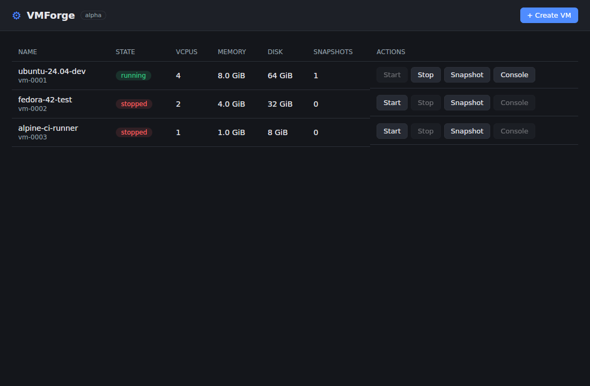
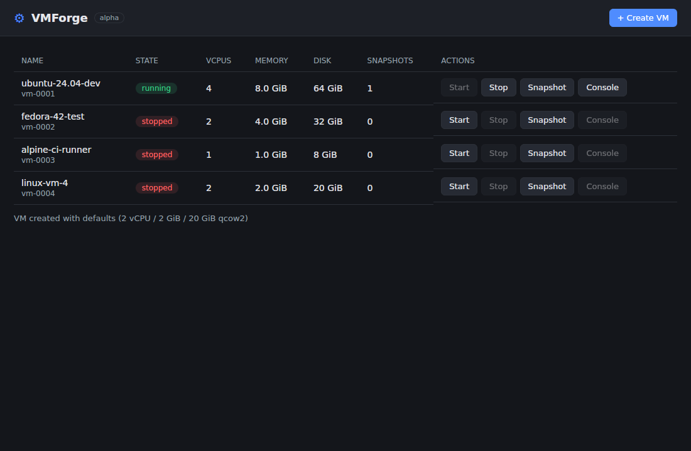

# VMForge

Desktop virtualization to rival VMware Workstation/Fusion and Parallels: instant-resume VMs, git-like VM snapshots/branching, first-class Linux + ARM support, local-first privacy.

This repository contains the **hypervisor abstraction layer (HAL)** scaffold from the Sprint 0/1 architecture spike. Full design: [`docs/architecture.md`](docs/architecture.md).

**Beta testers:** start with the [tester guide](docs/tester-guide/README.md) (quickstart, CLI reference, troubleshooting, bug reporting).

## Screenshots

The GUI alpha (Tauri-based VM manager, from the GUI alpha skeleton branch):





## Architecture summary

- **Language:** Rust (memory-safe systems code; rust-vmm ecosystem available for a future direct-KVM backend — https://github.com/rust-vmm).
- **One trait, many backends:** `vmforge-core` defines the `Hypervisor` trait, the VM lifecycle state machine (create/boot/pause/resume/stop/snapshot/restore/delete), and a git-like content-addressed snapshot DAG (`SnapshotStore`). Product code (GUI/CLI) only ever sees the trait.
- **Backends (stubs today):**
  - `vmforge-backend-kvm` — Linux, KVM-accelerated (https://docs.kernel.org/virt/kvm/api.html)
  - `vmforge-backend-hvf` — macOS, Hypervisor.framework-accelerated (https://developer.apple.com/documentation/hypervisor)
- **Engine strategy:** Phase 1 drives QEMU as a separate child process over QMP (`-accel kvm` / `-accel hvf`, https://www.qemu.org/docs/master/interop/qmp-spec.html) — keeping proprietary app code outside GPL scope via the process boundary (https://www.gnu.org/licenses/gpl-faq.html#MereAggregation). Phase 2 swaps in direct KVM-ioctl / Hypervisor.framework backends behind the same trait where snapshot/resume latency demands it.
- **Guest I/O:** virtio devices (OASIS spec, https://docs.oasis-open.org/virtio/virtio/v1.2/virtio-v1.2.html); 3D via virtio-gpu + virgl/Venus (https://docs.mesa3d.org/drivers/venus.html).

## Layout

```
crates/
  vmforge-core/          Hypervisor trait, VmConfig/VmState FSM, SnapshotStore, errors
  vmforge-backend-kvm/   Linux KVM backend (stub)
  vmforge-backend-hvf/   macOS Hypervisor.framework backend (stub)
  vmforge-cli/           `vmforge` CLI (`vmforge info`, `vmforge diagnose`)
docs/architecture.md     Design doc: components, state machine, licensing, risks
```

## Development

```sh
cargo build --workspace
cargo test --workspace
cargo clippy --workspace --all-targets -- -D warnings
cargo fmt --all --check
cargo run -p vmforge-cli -- info
cargo run -p vmforge-cli -- diagnose   # redacted bug-report bundle, see docs/diagnose.md
```

CI (GitHub Actions) runs fmt + clippy + build + test on every push/PR.

## Licensing posture

VMForge app code is proprietary. KVM is consumed via the ioctl API (no userspace GPL obligation — https://git.kernel.org/pub/scm/linux/kernel/git/torvalds/linux.git/tree/LICENSES/exceptions/Linux-syscall-note); QEMU (GPL-2.0, https://www.qemu.org/license.html) runs strictly as a separate process. Full dependency licensing table with sources in [`docs/architecture.md`](docs/architecture.md#7-dependency-licensing-table).
